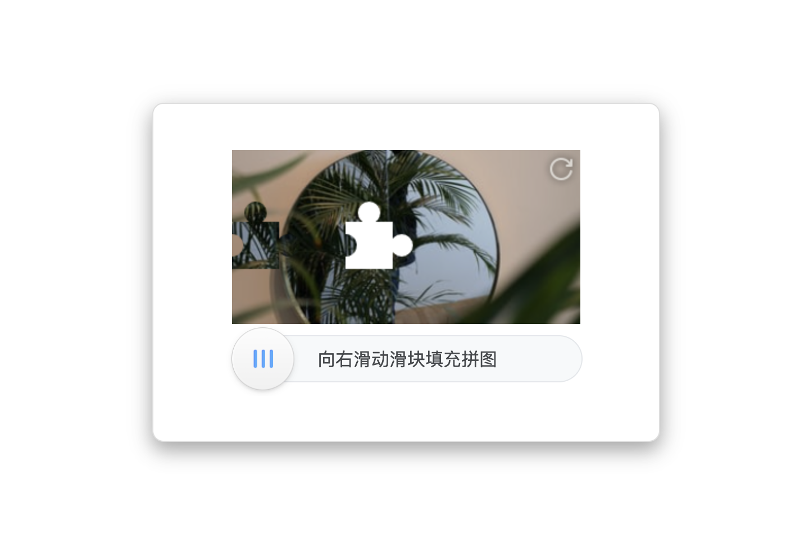

# puzzlejs-jigsaw

A simple picture puzzle.



## Usage

Install `puzzlejs-jigsaw` via [npm](https://www.npmjs.com/) or [yarn](https://yarnpkg.com/).

```sh
$ npm install puzzlejs-jigsaw
# or
$ yarn add puzzlejs-jigsaw
```

Then add this to your site:

```js
import $ from 'jquery';
import jigsaw from 'puzzlejs-jigsaw';

jigsaw.init(
  $('#jigsaw'),
  /**
   * callback when puzzle passed
   */
  function passed() {
    // TODO: implement or delete this
  },
  /**
   * callback when puzzle not passed
   */
  function rejected() {
    // TODO: implement or delete this
  }
);
```

## License

[MIT](LICENSE)
